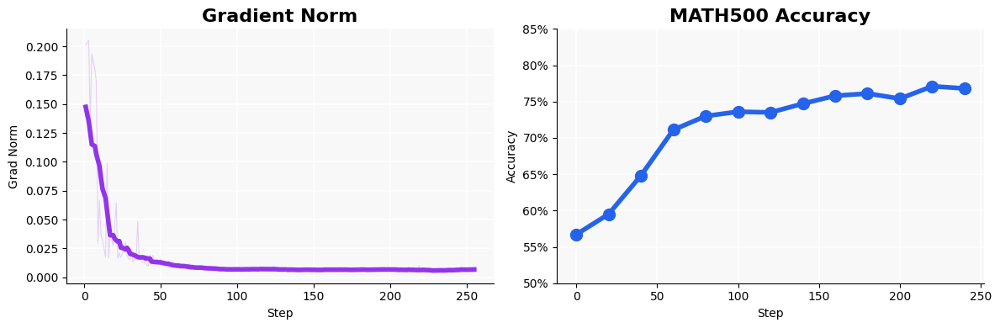

GRPO Custom Math Environment
============================

This tutorial demonstrates how to include custom environemnts. It covers training a language model on single-turn mathematical reasoning using GRPO
with group-relative advantage normalization. 

Full experiment: ``experiments/reinforce-math/``

.. code-block:: bash

   python experiments/reinforce-math/run.py

Single-turn vs. multi-turn
""""""""""""""""""""""""""

In a single-turn task the environment is straightforward: the model receives a prompt (the math
problem), generates a response, and the environment judges whether the answer is correct.
There is no opponent, no back-and-forth, and no role assignment.

This simplicity makes single-turn math a good setting for studying the learning algorithm itself,
isolated from the complexity of game dynamics.

Group-relative advantage
""""""""""""""""""""""""

The key idea in this experiment is **group-relative advantage**: instead of comparing each
rollout to an absolute baseline, advantages are computed relative to the other rollouts for the
*same prompt*.

For each training problem, 8 responses are sampled (``group_size=8``). The reward for each
response (1.0 for a correct answer, 0.0 otherwise, plus a small format reward) is then
normalized within the group:

.. math::

   A_i = \frac{r_i - \mu_{\text{group}}}{\sigma_{\text{group}} + \epsilon}

This means a correct answer is only positively reinforced if it is above the group average.
If the model solves every problem in a group correctly, the advantages cancel out and there is
no gradient — the model only learns from variation *within* the group.

Model and environment
"""""""""""""""""""""

The experiment uses ``Qwen3-4B-Base`` (larger than the TicTacToe experiment, as math reasoning
benefits from more capacity). The model is prompted with the ``qwen3-math`` template, which
encourages open-ended chain-of-thought before the final answer.

Training runs on ``math-12k-v0`` (12k math problems). Evaluation runs every 20 steps on
``math500-v0`` with 1000 rollouts, giving a stable accuracy estimate throughout training.

Buffer and batching
"""""""""""""""""""

This experiment uses an ``EpisodeBuffer`` with ``flatten=True``. Because advantages are computed
group-relative, the buffer must hold complete groups before sampling — ``flatten=True`` unrolls
each group into individual steps after the group-level normalization is applied.

``group_size=8`` must match between the env sampler (how many responses are collected per problem)
and the replay buffer (how groups are formed for normalization).

.. code-block:: yaml

   env_sampler:
     train:
       - id: "math-12k-v0"
         group_size: 8       # collect 8 responses per problem

   replay_buffer:
     type: "episode_buffer"
     flatten: true
     group_size: 8           # normalize advantages within groups of 8

The batch size is larger than TicTacToe (``local_batch_size=512``) because each problem only
produces a single reward signal, so more samples are needed for a stable gradient estimate.

Reward shaping
""""""""""""""

Reward shaping is minimal in this experiment:

- ``format_reward`` (±0.1) at step level: a small bonus for correctly formatted answers
  (e.g., answers wrapped in the expected tags). This helps early in training before the model
  has learned to answer correctly.
- ``group_relative_advantage`` at sampling time: normalizes rewards within each group of 8,
  as described above. No episode-level or environment-level normalization is needed because
  all problems come from the same distribution.

Key config
""""""""""

.. code-block:: yaml

   learner:
     type: "grpo"
     learning_rate: 0.00001
     local_batch_size: 512
     micro_batch_size: 1
     epochs: 1
     temperature: 1.0
     kl_coef: 0.0
     entropy_coeff: 0.0
     max_generation_len: 4096
     grad_clip: 0.1
     lora_cfg:
       lora_rank: 32
       lora_alpha: 32

   replay_buffer:
     type: "episode_buffer"
     flatten: true
     max_buffer_size: 1024
     group_size: 8
     reward_transformations:
       final: {}
       step:
         format_reward: {reward: 0.1, penalty: -0.1}
       sampling:
         group_relative_advantage: {}
